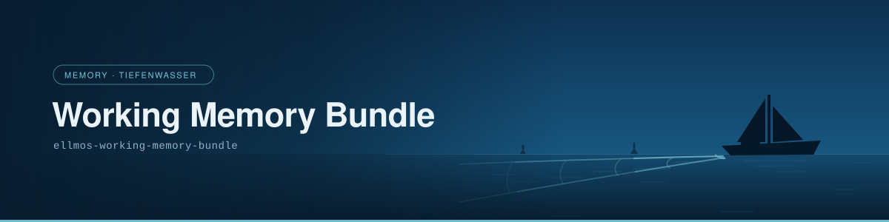
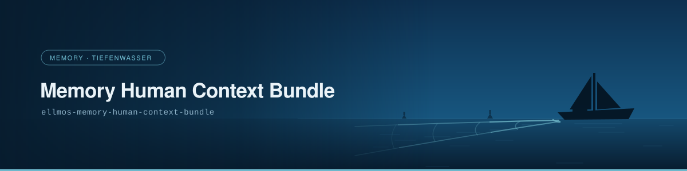
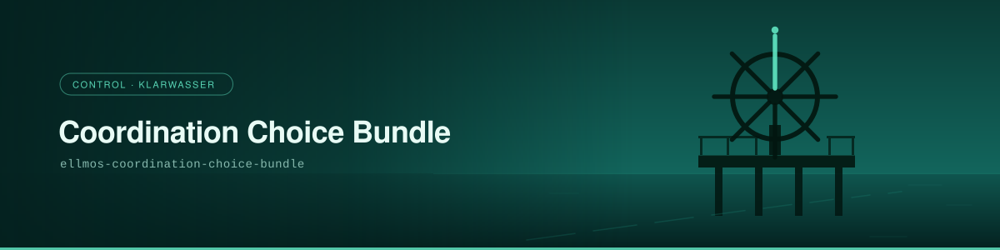
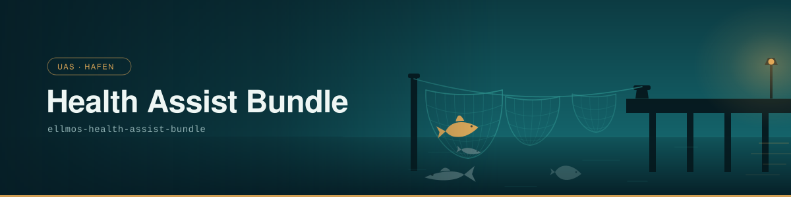
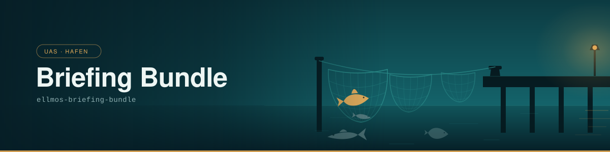
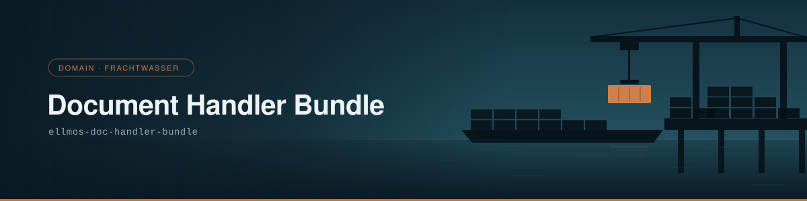

# bundles

The recipe layer of the ellmos ecosystem: bundle manifests, catalogues, and composition
knowledge.

*[Deutsch](README_de.md)*

> **Private build.** This repository opens **wave by wave**, not all at once. Its release
> conditions are written down and checkable — see *[Release conditions](#release-conditions)*.

> [!NOTE]
> **AI / LLM Integration**: For machine-readable context and LLM search terms, see
> [`llms.txt`](./llms.txt).

---

## Read this first: what a bundle is, and what it is not

**A bundle is a recipe, not a program.** These files describe which components form a working
unit, which role each fills, what it provides and consumes, and which alternatives were weighed.
They are machine-readable and you can compute with them — but nothing here starts.

There is no installer yet and no runtime of our own yet, so a recipe is executed by an agent CLI
you already run. The full system that will eventually consume these recipes is built in a
separate repository, **open-ocean**. Keeping the two apart is deliberate: the recipes are ready
months before the system is, and a repository that shipped recipes under the system's name would
be promising something that does not exist yet.

## Why a recipe is worth publishing at all

A bundle manifest is a **recipe = seed + ingredient list**.

The ingredient list is the easy half. Every bundle resolves completely into a flat list of
repositories, skills and agent roles — and every one of those is public and findable on its own.

The **seed** is the half that does not resolve: which parts belong together, which role each
fills, which alternative was chosen under which criteria, in what order things are built. That
knowledge is not recoverable from the ingredient list. **Having all the modules is not having the
system** — which is exactly why the recipes are the interesting thing to publish and not an
afterthought.

## What is in here today

13 bundles, in two rings. Every component of every one of them is publicly available today,
optional components included — that is the admission criterion.

**Ring 1 — the functional core.** The smallest set that adds up to a working system: memory both
short and long, access to an agent, selection knowledge, and a way to acquire knowledge.

| Bundle | Class | Pillar | Components | What it carries |
|---|---|---|---|---|
| `ellmos-working-memory-bundle` | platform | memory | 5 | session state: what was captured, what is still open |
| `ellmos-memory-human-context-bundle` | platform | memory | 6 | durable memory and the user model |
| `ellmos-agents-bundle` | platform | control | 7 | access to the runtime — the stand-in for a runtime of our own |
| `ellmos-coordination-choice-bundle` | choice | control | 2 | selection knowledge: the visible proof a recipe beats a list |
| `ellmos-knowledge-bundle` | platform | — | 8 | finding and preparing knowledge |

**Ring 2 — breadth at no extra risk.** Equally clean, and useful from day one.

| Bundle | Class | Pillar | Components |
|---|---|---|---|
| `ellmos-doc-handler-bundle` | domain | domain | 11 |
| `ellmos-media-production-bundle` | domain | — | 7 |
| `ellmos-daily-life-bundle` | domain | uas | 6 |
| `ellmos-voice-media-assist-bundle` | domain | uas | 3 |
| `ellmos-health-assist-bundle` | domain | uas | 2 |
| `ellmos-briefing-bundle` | domain | uas | 1 |
| `ellmos-finance-assist-bundle` | domain | uas | 1 |
| `ellmos-knowledge-search-choice-bundle` | choice | — | 1 |

60 component slots in total. `manifests/bundles.catalog.v1.json` is the index.

**What is deliberately absent:** bundles whose components are not all public yet. A recipe with
its alternatives trimmed away to make it publishable loses the very seed that made it worth
having, so those wait rather than ship diminished.

## How to read a manifest

| Field | What it tells you |
|---|---|
| `components[]` | the ingredient list: modules, skills, access surfaces, software apps |
| `requirement` | `required`, `recommended` or `optional` — what a deployment may leave out |
| `provides` / `consumes` | the capability each component brings and needs; this is what makes the list a graph rather than a pile |
| `role` | what a component is here *for*, which is not the same as what it is |
| `choice_groups` | alternatives for a role, with the criteria to pick between them; cardinality is owned by the composition rules, not by the bundle |
| `pillar` | the family: memory keeps state, control steers it, uas serves the person, domain carries subject matter |
| `class` | `platform`, `domain` and `hosted-private` are functional; `choice` is a selection register; `synthetic` expands to its members |
| `content_hash` | over the manifest without the field itself, so it can be verified in place |

## Status: the traffic light

Rollout is incremental, not a big bang. A bundle goes green when each of its components is public
and checked.

| | |
|---|---|
| Bundles green-capable | **13** |
| Blocked by components that are not public | 17 further bundles |
| Largest single lever | largely resolved on 2026-08-08 — three of the four repositories are public; `ellmos-core` alone still blocks three bundles |

Whether `ellmos-core` follows is a decision for the owner of the ecosystem, and no automated
process anticipates it.

## Release conditions

A wave is released when all three of these are met:

1. **Branding package complete** — repository cut, banner, how bundles appear on the organisation
   profile.
2. **Publication check passed** — law, privacy and licensing reviewed for the wave, no blockers.
3. **User click for this wave** — each wave is released on an explicit decision, and a released
   wave says nothing about the next one.

### Released so far

**Waves 1 and 2 — 2026-08-08, all thirteen bundles currently in this repository.**

| Condition | How it was met |
|---|---|
| 1 Branding | Banner, German page and self-contained preview exist for every bundle, plus an index over all thirteen; the design was reviewed and frozen by the owner on 2026-08-08. |
| 2 Publication check | `repo-publish-check` run over the full repository — every tracked file *and* the complete commit history scanned for credentials, local paths and hostnames; no blockers. Licence: MIT. |
| 3 User click | Explicit owner decision on 2026-08-08, covering waves 1 and 2 together (wave 2 had been gated only on a privacy fix, which was closed at source beforehand). |

The gate file `PRIVATE.txt` was removed in the same step — it existed to prevent an accidental
publication, and that risk ends where the repository becomes public.

**What still applies to later waves.** Condition 3 does not carry over: new recipes are not added
because the last wave went well. Each further wave is checked again under condition 2 **before it
is committed** — in a public repository the commit *is* the publication, so the check moves ahead
of it rather than ahead of a visibility switch.

## How these files got here

The recipes are not maintained here. They are **projected** out of a private composition
repository by `tools/export_from_source.py`, and what gets removed or rewritten on the way is
declared as data in an export contract rather than buried in the script:

- host names, internal paths and unresolvable internal identifiers are stripped or neutralised
- components carrying operating data of a real organisation are excluded — the source keeps them,
  this projection does not
- the private source repository is never named

Two properties make the result checkable rather than merely asserted:

- **Reproducible.** Run the export twice against the same source state and the second run
  produces no diff. `--check` reports drift instead of writing.
- **Verifiable.** Every manifest carries a `content_hash` over its exported form, and
  `manifests/export-receipt.v1.json` records the source state each file came from. A hash that
  belonged to the unexported original would make an honest file look tampered with, so the export
  re-pins them.

```bash
python tools/export_from_source.py --source <path-to-source> --check
```

## Banners and pages

**Status: the series is complete.** All 13 bundles have a banner, a page in German and a
self-contained local preview. The design was ratified on the pilot
(`ellmos-daily-life-bundle`) and is frozen since: palettes, template and generator do not move
any more, the series only adds scenes and polishes over the catalogue.

**→ [`docs/bundles/README.md`](docs/bundles/README.md) is the index**, grouped by pillar, with
every banner in it.

### The series at a glance

**Deep water — `memory`**

<p>
  <a href="docs/bundles/ellmos-working-memory-bundle.md"></a>
  <a href="docs/bundles/ellmos-memory-human-context-bundle.md"></a>
</p>

**Clear water — `control`**

<p>
  <a href="docs/bundles/ellmos-agents-bundle.md"></a>
  <a href="docs/bundles/ellmos-coordination-choice-bundle.md"></a>
</p>

**The harbour — `uas`**

<p>
  <a href="docs/bundles/ellmos-daily-life-bundle.md"></a>
  <a href="docs/bundles/ellmos-voice-media-assist-bundle.md"></a>
  <a href="docs/bundles/ellmos-health-assist-bundle.md"></a>
  <a href="docs/bundles/ellmos-briefing-bundle.md"></a>
  <a href="docs/bundles/ellmos-finance-assist-bundle.md"></a>
</p>

**Freight water — `domain`**

<p>
  <a href="docs/bundles/ellmos-doc-handler-bundle.md"></a>
  <a href="docs/bundles/ellmos-knowledge-bundle.md"></a>
  <a href="docs/bundles/ellmos-media-production-bundle.md"></a>
</p>

**Across two pillars**

<p>
  <a href="docs/bundles/ellmos-knowledge-search-choice-bundle.md"></a>
</p>

The visual language comes from the ecosystem's water lexicon: each of the four pillars is a
body of water with its own light and its own symbol.

| Pillar | Water | The picture |
|---|---|---|
| `memory` | deep water | the boat and the track opening astern — the memory carries, and it is the distance covered |
| `control` | clear water | the helm, one spoke marked: steering means making one course legible |
| `uas` | the harbour | different nets catch different fish; the species are the end products as one gets them |
| `domain` | freight water | crane, barge, containers — one piece of freight moves at a time |

`assets/design/README.md` carries the rules the series keeps, including what happens when a
manifest names no pillar; `assets/design/tokens.json` is the single place a colour is decided.

```bash
python tools/generate_banner.py <bundle-id>          # title and pillar from the manifest
python tools/generate_banner.py <bundle-id> --check  # drift instead of writing
```

Banners are drawn here rather than projected from the source, and they are reproducible the
same way the manifests are: no timestamps, no random placement, run twice and the second run
produces no diff. Every banner is self-contained SVG — no external fonts, no raster images,
no network references.

## Licence

MIT, chosen by the owner on 2026-08-08 and committed as [`LICENSE`](LICENSE). It covers
everything in this repository — manifests, contracts, documentation and tools alike; there is no
third-party code here to license separately, since both scripts under `tools/` use only the Python
standard library. That settles the licence part of the publication check; its law and privacy
parts stay open, per wave.
