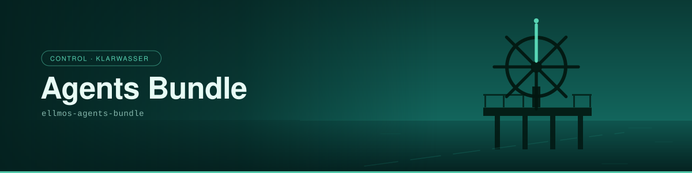

# Agents Bundle

> Die Agenten selbst und was es braucht, um sie zu erreichen: lokale Begleiter, kommerzielle Anbieter, Abonnements und API-Zugänge.

| | |
|---|---|
| **Bundle-ID** | `ellmos-agents-bundle` |
| **Säule** | `control` — steuert das System |
| **Klasse** | `platform` — funktional, zählt in der Deployment-Auflösung |
| **Version** | 1.0.0 |
| **Status / Lifecycle** | `registered` / `draft` |
| **Sichtbarkeit** | `private` (bis eine Welle freigegeben ist) |
| **Komponenten** | 7 — vier empfohlen, drei optional |
| **Ring** | Ring 1 der Erstprojektion |

## Wofür dieses Bundle da ist

Solange es keine eigene Laufzeit gibt, wird ein Rezept von einer Agenten-CLI ausgeführt, die ohnehin läuft. Dieses Bundle beschreibt genau diesen Zugang — es ist der Platzhalter für die Laufzeit, die noch nicht existiert, und deshalb Teil des funktionalen Kerns.

Das Manifest sagt selbst, was es besonders macht: *the only hub whose members are largely not repositories*. Drei seiner sieben Mitglieder sind **Zugangsflächen** (`access_surface`) — kein Code, den man klont, sondern ein Anbieter, ein Abonnement, ein API-Schlüssel. Der Typ wurde bewusst gewählt: Er ist der, den der festgenagelte Resolver in einem Bundle-Manifest bereits akzeptiert.

Alle drei verlangen `provider-credentials`, und dazu steht eine Regel im Manifest, die keine Ausnahme kennt: **niemals ein Geheimnis, immer nur ein Ort.** Die Werte bleiben im Credentials-Ordner außerhalb von OneDrive und außerhalb jedes Repositoriums; ein Rezept nennt den Fundort, nie den Inhalt.

## Das Bild: Klarwasser

Das Klarwasser ist die Control-Säule, und ihr Zeichen ist das Steuerrad: ruhiges Wasser, in dem man den Kurs sieht, bevor man ihn hält. Eine Speiche ist markiert — die Königsspeiche, die traditionell anzeigt, dass das Ruder mittschiffs steht. Sie ist der einzige Akzent im Bild, weil Steuern heißt: **einen** Kurs kenntlich machen.

Für den Zugang zu den Agenten passt es doppelt: Das Steuerrad ist der Ort, an dem man **etwas** in der Hand hält — auch dann, wenn das Schiff einem nicht gehört.

## Komponenten

Ein Modul, drei Zugangsflächen, drei Skills.

| Rolle | Komponente | Version | Bedarf | liefert | braucht |
|---|---|---|---|---|---|
| Lokaler Begleiter | `module:companion-for-agy` | `v4-shadow` | empfohlen | — | — |
| Anbieter | `access_surface:agent-providers` | `v4-shadow` | empfohlen | `agent-runtime-access` | `provider-credentials` |
| Abonnements | `access_surface:agent-subscriptions` | `v4-shadow` | optional | `provider-quota` | `provider-credentials` |
| API-Zugänge | `access_surface:agent-apis` | `v4-shadow` | optional | `programmatic-agent-access` | `provider-credentials` |
| Modellwahl | `skill:model-strategy` | `registry-current` | empfohlen | `model-routing-decision` | `provider-capabilities` |
| Startregeln | `skill:agents-bridge` | `registry-current` | empfohlen | `multi-agent-boot-pointer` | `canonical-authorities` |
| Unbeaufsichtigte Läufe | `skill:headless` | `registry-current` | optional | `unattended-run-mode` | `approved-autonomy-scope` |

Eine Lücke ist im Manifest vermerkt statt verschwiegen: **kein Skill deckt heute die Inventur von Anbietern, Abonnements und Kontingenten ab.** Der Kandidatenname aus dem Vorschlagsdokument ist festgehalten (`provider-subscription-inventory`), gebaut ist er nicht.

**Profile:** `full` und `operator`, beide ohne Ein- oder Ausschlüsse.

## Ampel

Der Rollout ist inkrementell: Ein Bundle geht grün, wenn **jede** seiner Komponenten öffentlich und geprüft ist. Genau das ist das Aufnahmekriterium dieses Repos — die 13 projizierten Bundles sind die, deren Komponenten heute vollständig öffentlich sind, optionale eingeschlossen. Dieses Bundle ist damit **grün-fähig**.

Grün-fähig heißt nicht veröffentlicht. Die Freigabe einer Welle ist eine ausdrückliche Entscheidung des Eigentümers (`PRIVATE.txt`), und keine Automatik nimmt sie vorweg.

## Herkunft und Prüfbarkeit

| | |
|---|---|
| Manifest | [`manifests/bundles/ellmos-agents-bundle/bundle.v1.json`](../../manifests/bundles/ellmos-agents-bundle/bundle.v1.json) |
| Katalog-Eintrag | [`manifests/bundles.catalog.v1.json`](../../manifests/bundles.catalog.v1.json) |
| Funktionsvertrag | [`contracts/bundle-family-contract.v1.json`](../../contracts/bundle-family-contract.v1.json) |
| Zusicherungsvertrag | `contract:mandatory-assurance-v1` (1.0.0) |
| `content_hash` | `ac6c116860bdadc0df52d0e1f270117808d32071cf3b6cef3f1be4dabf1d3808` |

Der `content_hash` läuft über das Manifest ohne das Hash-Feld selbst — er ist an Ort und Stelle nachrechenbar, ohne Zusatzdatei.

Das Manifest wird **nicht hier gepflegt**, sondern aus der privaten Kompositionsquelle projiziert (`tools/export_from_source.py`). Der Banner dagegen entsteht in diesem Repo, aus `assets/design/` heraus: `python tools/generate_banner.py ellmos-agents-bundle`. `--check` statt Schreiben meldet Abweichung.

---

*Teil der Banner- und Seitenserie über alle 13 Bundles — [Übersicht](README.md). Bildsprache und Regeln der Serie: [`assets/design/README.md`](../../assets/design/README.md).*
