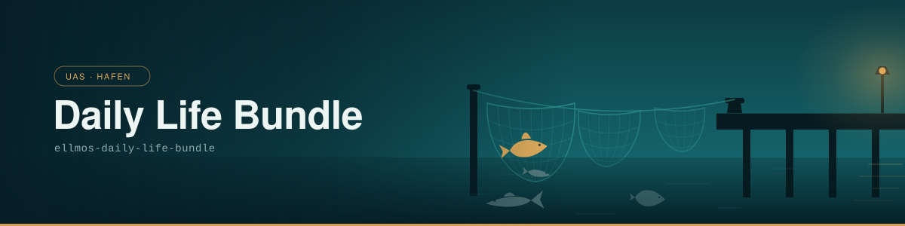

# Daily Life Bundle

> Alltagsnahe Haushalts- und Orientierungsdienste — nah an der Person.

| | |
|---|---|
| **Bundle-ID** | `ellmos-daily-life-bundle` |
| **Säule** | `uas` — bedient die Person direkt |
| **Klasse** | `domain` — funktional, zählt in der Deployment-Auflösung |
| **Version** | 1.0.0 |
| **Status / Lifecycle** | `registered` / `draft` |
| **Sichtbarkeit** | `private` (bis eine Welle freigegeben ist) |
| **Komponenten** | 6 — eine empfohlen, fünf optional |

## Wofür dieses Bundle da ist

Es deckt den Teil des Alltags ab, den man nicht plant, sondern hat: Haushalt, Vorräte,
Wetter, Wege, Orte, die Nachrichtenlage am Morgen. Die Manifest-Zweckzeile sagt genau das
in einem Satz — *everyday household and orientation services close to the person*.

„Nah an der Person“ ist dabei keine Floskel, sondern der Grund für die Zuordnung zur
**UAS-Säule**: Alle sechs Komponenten arbeiten auf freigegebenem persönlichem Kontext oder
freigegebenen Ortsdaten (`approved-personal-context`, `approved-location`,
`approved-source-set`). Das Bundle nimmt nichts, was ihm nicht ausdrücklich gegeben wurde —
sichtbar in der Spalte *braucht*, nicht bloß behauptet.

Bemerkenswert ist die Gewichtung: **genau eine** Komponente ist empfohlen, fünf sind
optional. Dieses Bundle schreibt keinen Alltag vor. Es hält sechs Dienste bereit, von denen
sich jede Installation das nimmt, was zu ihr passt.

## Das Bild: Hafen, Netze, Fischarten

Der Hafen ist die UAS-Säule — der Ort, an dem Mensch und System aneinander andocken.
Am Kai hängen **verschiedene Netze**: jeder Dienst ein eigenes, für seinen eigenen Fang
gebaut. Und was in den Netzen liegt, sind **verschiedene Fischarten** — die Endprodukte,
wie man sie bekommt: der Haushaltsplan, der Wegplan, die Morgenübersicht. Aufbereitet und
verwertbar, nicht Rohdaten. Ein Netz hält den Fang, auf den das Licht fällt; die anderen
hängen daneben, bereit.

## Komponenten

Alle sechs sind Skills. `registry-current` heißt: die Version zieht das Deployment aus der
Skill-Registry, das Rezept nagelt sie nicht fest.

| Rolle | Komponente | Bedarf | liefert | braucht |
|---|---|---|---|---|
| Haushaltsroutinen | `skill:haushalt-manager` | empfohlen | `household-plan` | `approved-personal-context` |
| Bestandsdurchsicht | `skill:hauslagerist-reader` | optional | `inventory-review` | `approved-personal-context` |
| Wetterabfrage | `skill:wetter` | optional | `weather-report` | `approved-location` |
| Routenplanung | `skill:reiseroute` | optional | `route-plan` | `approved-location` |
| Ortssuche | `skill:location-suche` | optional | `location-candidates` | `approved-location` |
| Tagesbriefing | `skill:tageszeitung` | optional | `daily-digest` | `approved-source-set` |

Die Spalten *liefert* und *braucht* sind das, was die Zutatenliste zu einem Graphen macht
statt zu einem Haufen: `approved-location` wird von drei Diensten verlangt und von keinem
erzeugt — es kommt von außen, aus einer Freigabe.

**Profile:** `full` und `operator` sind angelegt, aber beide ohne Ein- oder Ausschlüsse und
ohne Overrides. Sie unterscheiden hier heute nichts.

## Ampel

Der Rollout ist inkrementell: Ein Bundle geht grün, wenn jede seiner Komponenten öffentlich
und geprüft ist.

| | |
|---|---|
| Komponenten öffentlich verfügbar | alle 6, die optionalen eingeschlossen |
| Ampel | **grün-fähig** — Ring 2 der Erstprojektion |
| Noch nicht grün, weil | die Welle als Ganzes noch nicht freigegeben ist (`PRIVATE.txt`) |

Grün-fähig heißt nicht veröffentlicht. Die Freigabe einer Welle ist eine ausdrückliche
Entscheidung des Eigentümers, und keine Automatik nimmt sie vorweg.

## Herkunft und Prüfbarkeit

| | |
|---|---|
| Manifest | [`manifests/bundles/ellmos-daily-life-bundle/bundle.v1.json`](../../manifests/bundles/ellmos-daily-life-bundle/bundle.v1.json) |
| Katalog-Eintrag | [`manifests/bundles.catalog.v1.json`](../../manifests/bundles.catalog.v1.json) |
| Funktionsvertrag | [`contracts/bundle-family-contract.v1.json`](../../contracts/bundle-family-contract.v1.json) |
| Zusicherungsvertrag | `contract:mandatory-assurance-v1` (1.0.0) |
| `content_hash` | `2a1e29fdd6a2befa01beee24efbcbfc23c141fbad906c04613c1b9399209cf9c` |

Der `content_hash` läuft über das Manifest ohne das Hash-Feld selbst — er ist also an Ort
und Stelle nachrechenbar, ohne Zusatzdatei.

Das Manifest wird **nicht hier gepflegt**, sondern aus der privaten Kompositionsquelle
projiziert (`tools/export_from_source.py`). Der Banner dagegen entsteht in diesem Repo, aus
`assets/design/` heraus: `python tools/generate_banner.py ellmos-daily-life-bundle`.

---

*Diese Seite war der Pilot der Banner- und Seitenserie. Layout, Palette und Bildsprache wurden
am 2026-08-08 abgenommen und sind seitdem eingefroren; die übrigen zwölf Bundles sind danach
gefolgt — [Übersicht über alle 13](README.md).*
