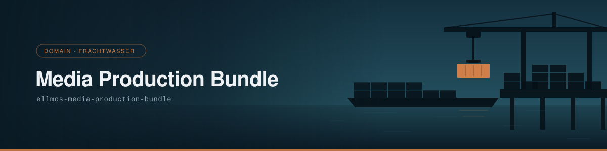

# Media Production Bundle

> Medienbearbeitung, Rechenleistung, Netz-Abruf und Berichts-Kompositionen.

| | |
|---|---|
| **Bundle-ID** | `ellmos-media-production-bundle` |
| **Säule** | `domain` — trägt Fachgut — *abgeleitet* |
| **Klasse** | `domain` — funktional, zählt in der Deployment-Auflösung |
| **Version** | 1.0.0 |
| **Status / Lifecycle** | `registered` / `draft` |
| **Sichtbarkeit** | `private` (bis eine Welle freigegeben ist) |
| **Komponenten** | 7 — eine erforderlich, drei empfohlen, drei optional |
| **Ring** | Ring 2 der Erstprojektion |

## Wofür dieses Bundle da ist

Die **produzierende** Seite der Medienarbeit: schneiden, rechnen, abrufen, daraus etwas herstellen. Das Manifest führt hier als einziges eine Komponente vom Typ `software_app` — `MediaBrain`, optional.

Die Abgrenzung kommt vom Gegenstück her: Das [Voice-and-Media-Assist-Bundle](ellmos-voice-media-assist-bundle.md) sagt von sich selbst *„Assistance, not production“* und verweist auf dieses Bundle als die produzierende Seite. Wer diktiert und hört, ist dort; wer herstellt, ist hier.

Der Katalog vermerkt außerdem einen Namen, der es nicht ins Manifest geschafft hat: Der Nutzervorschlag hieß **MEDIA HUB**. Er steht im Katalog statt im Manifest, weil dessen Hash durch eine lebende Freigabe festgenagelt ist.

## Säule: woher sie kommt

Diese Säule steht **nicht** im Manifest, sondern im Katalog. `manifests/bundles.catalog.v1.json` führt unter `pillars.omissions.approval_pinned` wörtlich *„intended pillar domain, not written“* — und den Grund: Der Manifest-Hash ist durch eine lebende Freigabe (`manifests/module-readme-discovery.approvals.v1.json`, `default_action: deny`) festgenagelt. Ein zusätzliches Feld würde eine erteilte Freigabe stillschweigend entwerten. Der Banner nimmt die Säule also aus dem Katalog, wo sie belegt ist, statt sie zu raten — und diese Seite sagt es, statt es zu verschweigen.

## Das Bild: Frachtwasser

Das Frachtwasser ist die Domain-Säule: das Fachgut als Ladung — umgeschlagen, gestapelt, transportiert. Ein Kran hebt genau **ein** Stück Fracht, und dieses eine ist der Akzent des Bildes; an Land liegt, was schon gelöscht ist, auf dem Leichter, was noch fährt. Bewegt wird immer nur ein Stück auf einmal — das ist der Unterschied zwischen einem Stapel und einem Umschlag.

Produktion ist Umschlag: Rohmaterial kommt an, Fertiges geht weg, und der Kran bewegt genau ein Stück.

## Komponenten

Vier Module, eine Anwendung und zwei Skills.

| Rolle | Komponente | Version | Bedarf | liefert | braucht |
|---|---|---|---|---|---|
| Medienschnitt | `module:ai-media-editor` | `v4-shadow` | erforderlich | — | — |
| Rechenleistung | `module:open-compute` | `v4-shadow` | empfohlen | — | — |
| Netz-Abruf | `module:web-scraper` | `v4-shadow` | empfohlen | — | — |
| Berichtsbau | `module:report-forge` | `v4-shadow` | empfohlen | — | — |
| Medienregal | `software:MediaBrain` | `v4-shadow` | optional | — | — |
| Textproduktion | `skill:textproduction` | `registry-current` | optional | `text-production-workflow` | `approved-content-brief` |
| Video-Transkription | `skill:video-transcriber` | `registry-current` | optional | `source-backed-transcript` | `approved-media-source` |

`video-transcriber` liefert einen `source-backed-transcript` — quellengestützt, nicht zusammengefasst. Der Unterschied ist der Grund, warum das Werkzeug im System überhaupt existiert.

**Profile:** `full` und `operator`, beide ohne Ein- oder Ausschlüsse.

## Ampel

Der Rollout ist inkrementell: Ein Bundle geht grün, wenn **jede** seiner Komponenten öffentlich und geprüft ist. Genau das ist das Aufnahmekriterium dieses Repos — die 13 projizierten Bundles sind die, deren Komponenten heute vollständig öffentlich sind, optionale eingeschlossen. Dieses Bundle ist damit **grün-fähig**.

Grün-fähig heißt nicht veröffentlicht. Die Freigabe einer Welle ist eine ausdrückliche Entscheidung des Eigentümers (`PRIVATE.txt`), und keine Automatik nimmt sie vorweg.

## Herkunft und Prüfbarkeit

| | |
|---|---|
| Manifest | [`manifests/bundles/ellmos-media-production-bundle/bundle.v1.json`](../../manifests/bundles/ellmos-media-production-bundle/bundle.v1.json) |
| Katalog-Eintrag | [`manifests/bundles.catalog.v1.json`](../../manifests/bundles.catalog.v1.json) |
| Funktionsvertrag | keiner — dieses Manifest führt kein `functional_contracts` |
| Zusicherungsvertrag | `contract:mandatory-assurance-v1` (1.0.0) |
| `content_hash` | `c9800be34d713f4b24e53ce392599d714f2e651972f9fcacefd66d01677d6dd8` |

Der `content_hash` läuft über das Manifest ohne das Hash-Feld selbst — er ist an Ort und Stelle nachrechenbar, ohne Zusatzdatei.

Das Manifest wird **nicht hier gepflegt**, sondern aus der privaten Kompositionsquelle projiziert (`tools/export_from_source.py`). Der Banner dagegen entsteht in diesem Repo, aus `assets/design/` heraus: `python tools/generate_banner.py ellmos-media-production-bundle --pillar domain`. `--check` statt Schreiben meldet Abweichung.

---

*Teil der Banner- und Seitenserie über alle 13 Bundles — [Übersicht](README.md). Bildsprache und Regeln der Serie: [`assets/design/README.md`](../../assets/design/README.md).*
